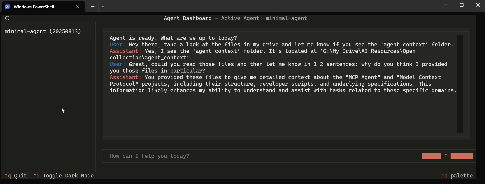

# Agent Dashboard
See also: [[Model-Context Pipeline]]
- ## Overview
	- A custom-built tool I've engineered for rapidly experimenting with agentic workflows.
	- 
	- Python · fast-agent · LLM APIs · Textual (Terminal UI)
	- [View the code on GitHub](https://github.com/Ethan23p/agent-dashboard)
- ## Problem
	- Consumer-facing AI products like ChatGPT, Zapier are useful but unsatisfactory for the needs of professionals in an ever evolving industry; they need solutions that are consistent, reliable, scalable, and pleasant to use.
- ## Solution
	- I use the Agent Dashboard to rapidly author, test, and manage powerful AI 'agents'. These are a team of specialized AIs that work together to create solutions greater than the sum of their parts. This 'agentic' approach allows me to solve problems traditional automation can't touch.
- ## Outcome
	- This project demonstrates the the value I provide to my clients; by implementing similar bespoke tools & workflows a business can:
		- **Automate high complexity, low value tasks**: Go beyond simple automation to solve multi-step, well-defined processes that currently require significant manual effort.
		- **Increase team efficiency and focus**: Free your skilled team from the subtly toxic drain of tedious work, allowing them to concentrate on high-impact, strategic initiatives.
		- **Modernize operations**: Create a reliable, scalable, intuitive system which turns such messy internal processes into a competitive advantage.
- ## Insight
	- Modern automation relieves people of tedious work and the need for perfect precision;
	- Thus freeing up people and resources;
	- Which means people have more time & attention for what really matters: The human element of work that gets us out of bed in the morning;
	- Free resources means freedom to choose where to direct them.