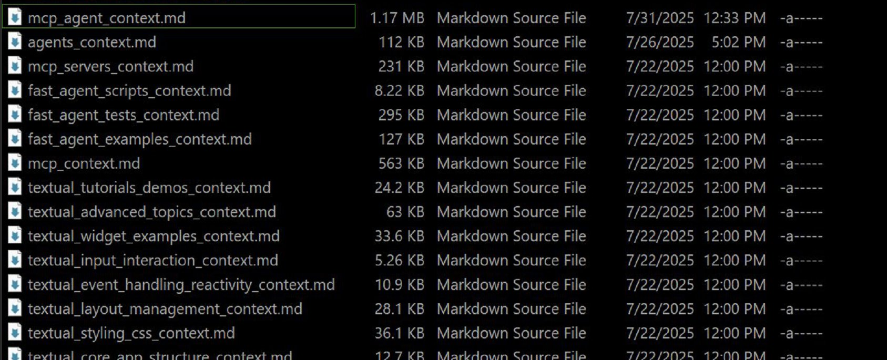

# Model-Context Pipeline
- ## Overview
	- A custom pipeline that builds a 'source of truth' for AI, granting the reliability and accountability required for professional work.
	- 
	- [View the code on GitHub](https://github.com/Ethan23p/agent-context-script)
- ## Problem
	- Frontier AI models (in late 2025) are not suitable for use in a professional context, typically; while they can occasionally be brilliant they are consistently unreliable and difficult to steer. Even so, the potential of these systems if they could understand proprietary systems or specific project documentation is massive.
- ## Solution
	- I crafted a system which makes an AI assistant reliable and even accountable by generating a bespoke "source of truth" for a given subject which I can provide the AI to directly reference & synthesize information from.
	- The source of truth comes from the documentation, source code, and other text-based sources which have to be downloaded, optimized, and packaged; then, taking advantage of the massive context window of modern systems, the AI is able to precisely cite the documentation.
- ## Outcome
	- This project demonstrates the value I provide to my clients; by implementing a similar context-engineering pipeline, a business can:
		- **Create Subject-Matter Experts**: Transform a generalist AI into a specialist with deep knowledge of your internal tools, APIs, and codebases.
		- **Drastically Increase Reliability & Trust**: Generate AI-driven insights and code that are consistently accurate, as the model is grounded in your approved documentation.
		- **Accelerate Development & Onboarding**: Provide developers with an AI pair programmer that can answer complex questions with verifiable answers, complete with direct references to the source material.
- ## Insight
	- Creating a "source of truth" based on the documentation and source code means the intelligence can be focused, thus creating a specialist which can provide guidance, synthesis information, and cite its answers.
	- Large context windows are key to aligning AI with specific context and creating reliability.